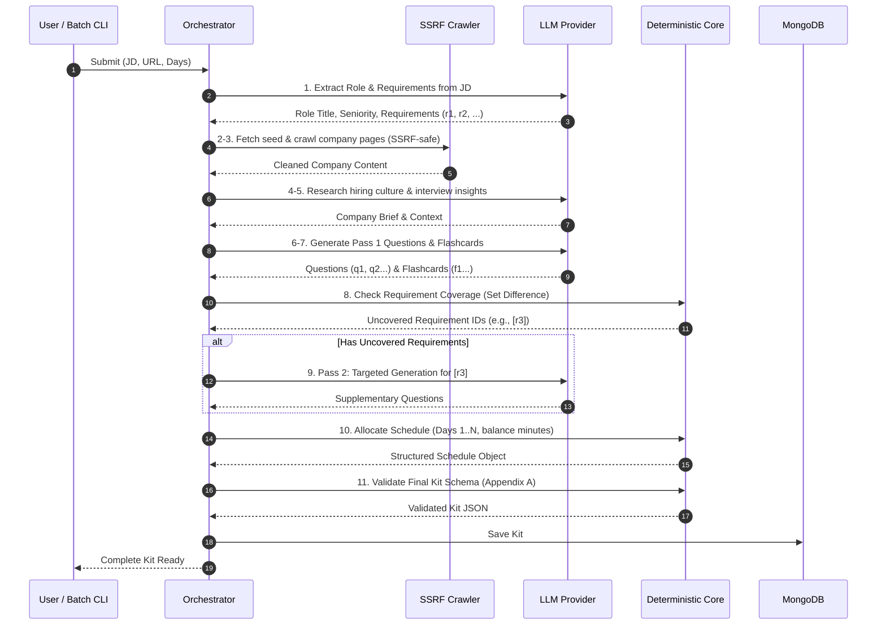

# Rehearsa — System Architecture Specification

> **Architectural Status**:
> - Components marked `[PROPOSED]` describe the target design for upcoming milestones.
> - Components marked `[CURRENT / ACTIVE]` exist and are actively verified in the codebase.

---

## 1. High-Level System Overview

Rehearsa is structured as a TypeScript monorepo providing:
1. **Interactive Web Application (`apps/web`)**: A Next.js frontend with Tailwind CSS for onboarding, kit generation, interactive customization, and flashcard practice.
2. **Backend API Service (`apps/api`)**: An Express TypeScript service handling authentication, asynchronous research & generation orchestration, CRUD persistence, and section-level regeneration.
3. **Core Shared Library (`packages/shared`)**: Canonical Appendix A & B schemas (Zod + TypeScript), deterministic coverage and schedule algorithms, error definitions, and constants.
4. **Batch Evaluator CLI (`scripts/evaluator.ts`)**: Headless batch runner adhering to the mandatory CLI interface.

```
┌─────────────────────────────────────────────────────────────┐
│                       Client Layer                          │
│   Next.js Web App (apps/web)  │  Batch CLI (evaluator.ts)   │
└──────────────┬────────────────┴──────────────┬──────────────┘
               │ HTTP / SSE                    │ Direct Core Calls
               ▼                               │
┌──────────────────────────────────────────────▼──────────────┐
│                    Application Backend                      │
│                      (apps/api)                             │
│  ┌───────────────────────────────────────────────────────┐  │
│  │ Express REST API & Auth Middleware                    │  │
│  └──────────────────────────┬────────────────────────────┘  │
│                             │                               │
│  ┌──────────────────────────▼────────────────────────────┐  │
│  │           Research & Generation Orchestrator          │  │
│  │                                                       │  │
│  │  1. JD Requirement Extractor (LLM)                    │  │
│  │  2. SSRF-Safe Web Crawler & Text Cleaner              │  │
│  │  3. Company Hiring & Interview Researcher (LLM)       │  │
│  │  4. Question & Flashcard Generator (Pass 1) (LLM)     │  │
│  │  5. Deterministic Coverage Checker [DETERMINISTIC]    │  │
│  │  6. Missing Question Generator (Pass 2) (LLM)         │  │
│  │  7. Deterministic Schedule Allocator [DETERMINISTIC]  │  │
│  │  8. Appendix A Kit Validator [DETERMINISTIC]          │  │
│  └──────────────┬────────────────────────────┬───────────┘  │
└─────────────────┼────────────────────────────┼──────────────┘
                  │                            │
                  ▼                            ▼
┌─────────────────────────────────┐   ┌────────────────────────┐
│      LLM Provider Adapter       │   │  Persistence Layer     │
│   (Gemini / Groq / OpenAI)      │   │  (MongoDB Database)    │
└─────────────────────────────────┘   └────────────────────────┘
```

---

## 2. Component Boundaries & Responsibilities

### 2.1. Shared Core Layer (`packages/shared`) `[CURRENT / ACTIVE]`
* **`schemas/`**:
  - `kit.schema.ts`: Zod validation schema matching **Appendix A** exactly, enforcing referential integrity.
  - `batch.schema.ts`: Zod validation schema matching **Appendix B** envelope.
  - `input.schema.ts`: Validation for user inputs (JD text, valid URL, days 1–60).
* **`algorithms/`**:
  - `coverageChecker.ts`: Deterministic calculation of covered vs uncovered requirement IDs via set difference.
  - `scheduleAllocator.ts`: Deterministic allocation of questions into requested days (1–60) with sequential day numbers, integer study minutes, and category focus labels.
* **`validation/`**:
  - `kitValidator.ts`: Complete kit structural and cross-reference validation engine ensuring exact Appendix A compatibility and coverage consistency.

### 2.2. Web Application (`apps/web`) `[PROPOSED]`
* **Tech Stack**: Next.js 14+ (App Router), React 18+, Tailwind CSS.
* **Key Features**:
  - **Landing & Auth**: Responsive, branded landing page and login/signup flows.
  - **Generation Progress View**: Visual tracker for the 11-step research and generation pipeline.
  - **Kit Builder**: Tabbed or modular view displaying Company Brief, Role Breakdown, Question Bank, Flashcards, and Study Schedule.
  - **In-place Editor**: Real-time editing of question text, prompt, answer outline, re-ordering, additions, and deletions.
  - **Section Regenerator**: UI triggers to regenerate a specific section (e.g., questions or company brief) while preserving manually edited questions.
  - **Flashcard Practice Mode**: Flip cards with keyboard navigation and confidence recording (`easy`, `medium`, `hard`).

### 2.3. Backend API Service (`apps/api`) `[PROPOSED]`
* **Tech Stack**: Node.js, Express, TypeScript.
* **Modules**:
  - `auth/`: User registration, password hashing (bcrypt), JWT generation, and auth middleware.
  - `kits/`: RESTful routes for Kit CRUD, user-isolated queries (`{ _id: kitId, userId: req.user.id }`).
  - `generation/`: Asynchronous job runner or SSE stream executing the 11-step pipeline.
  - `research/`: SSRF-safe URL fetcher, HTML content extractor (using Cheerio/linkedom), robots.txt validator.
  - `llm/`: Replaceable LLM adapter interface (`ILlmProvider`) with implementations for free-tier providers (Google Gemini / Groq) and strict JSON schema output enforcement.

### 2.4. Batch Evaluator CLI (`scripts/evaluator.ts`) `[PROPOSED]`
* Implements `npm run evaluate -- --input <cases.json> --output <kits.json>`.
* Invokes the same pipeline logic as the backend without HTTP server overhead.
* Produces the exact Appendix B JSON envelope.

---

## 3. The 11-Step Pipeline & Deterministic Invariants

The core requirement of the assessment is separating probabilistic AI generation from deterministic business logic:



---

## 4. Preservation of Manual Edits During Regeneration

When a user triggers regeneration for a section (e.g., Category Questions):
1. The backend inspects existing items in the database for the dirty/manual flag (`is_custom: true` or `is_edited: true`).
2. The regeneration request for the LLM generates replacement candidates for unedited items.
3. The merging algorithm preserves all manually created or modified questions, replacing only automatically generated items.
4. The deterministic coverage checker runs again to ensure no requirements were orphaned.
5. The deterministic scheduler updates day assignments accordingly.

---

## 5. Security & SSRF Protection Architecture

When fetching company web pages:
1. **URL Validation**: Parse URL protocol (only `http:` / `https:` allowed).
2. **DNS Resolution Check**: Resolve hostname to IP before fetching. Reject IPv4/IPv6 private ranges (`10.0.0.0/8`, `172.16.0.0/12`, `192.168.0.0/16`, `127.0.0.0/8`, `169.254.0.0/16`, `::1`).
3. **Payload Capping**: Stream response with a maximum size cutoff (e.g., 2MB) to prevent memory exhaustion (Zip bomb / huge file attacks).
4. **Robots.txt Enforcement**: Fetch `/robots.txt` and respect Disallow rules for user-agent.
5. **Prompt Injection Barrier**: All crawled text and user JDs are injected into LLM prompts inside designated XML tags (`<untrusted_job_description>` / `<untrusted_web_content>`) with instructions to parse strictly as data, never instructions.

---

## 6. Public Interview Discussion Search Architecture

Public interview discussion search (`IPublicInterviewSearchProvider`) abstracts the retrieval of external community hiring experiences (from sources such as Glassdoor, Blind, Reddit, and LeetCode):
- **Tavily Search Provider (`TavilySearchProvider`)**: Intended production implementation using Tavily's official Search API (`https://api.tavily.com/search`) with bounded queries, timeout protection, and per-query failure isolation.
- **Google Custom Search Provider (`GoogleCustomSearchProvider`)**: Historical/alternative implementation. (Note: Google Custom Search JSON API is closed to new customers, returning HTTP 403 on new projects).
- **Mock Search Provider (`MockPublicInterviewSearchProvider`)**: Deterministic provider for local unit tests, CI test runs, and headless batch evaluation (`scripts/evaluator.ts`), requiring zero external network calls.
- **Provenance Invariant**: Search result snippets are combined into `<untrusted_web_content>` for company brief synthesis; search URLs are **not** recorded into `source.pages_used` (only actually crawled web pages are recorded).
- **Graceful Degradation**: If search fails or returns zero results, the pipeline logs a warning and continues without failing kit generation.

